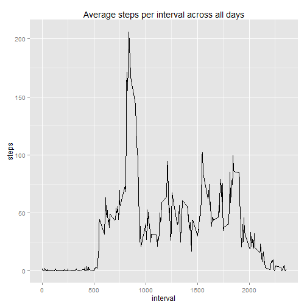

## Loading and preprocessing the data

The global settings for the R markdown file are to show the R code and cache the 
data:

```r
library(knitr)
opts_chunk$set(echo=TRUE,cache=TRUE)
```

To load and preprocess the data, I first provide the URL to the data:

```r
fileUrl <- "https://github.com/ab604/RepData_PeerAssessment1/blob/master/activity.zip"
```

If the data is not already downloaded and unzipped, this is the code to get it. 
It also produces a log file:

```r
if(!file.exists("activity.csv")){
        download.file(fileUrl,destfile="activity.zip")
        dateDownloaded <- date()
        # Unzip data
        unzip(zipfile = "activity.zip", files = NULL,
              unzip = "internal") 
        # Create logfile
        log_con <- file("activity_download.log")
        cat (fileUrl,"\n","destfile= activity.zip",
             "\n","destdir =", getwd(),"\n",dateDownloaded, 
             file = log_con)
        close(log_con)
}
```
The read in the unzipped CSV file to a data frame:

```r
raw <- read.csv("activity.csv",stringsAsFactors = FALSE,
                    na.strings="NA")
```
And convert dates strings to dates class:

```r
raw$date <- as.Date(raw$date)
```

The data frame is called `raw` contains 17568 observations of activity data for 
steps taken for 5 minute intervals from the 1st October 2010 to 30th November 2010. 
The obervations therefore are for three variables: the number of `steps`, the `date` 
and the index for the 5 minute `interval` in which the steps occurred.

## What is mean total number of steps taken per day?

**1. Calculate the total number of steps taken per day**

I calculated the total steps per day in the raw data by using aggregate to subset 
the steps for each day and then sum them:

```r
raw.daily.tots <- aggregate(list(steps = raw$steps), 
                            list(date = raw$date), sum)
```

**2. Make a histogram of the total number of steps taken each day**

I made a histogram of total steps per day using `ggplot` and set the binwidth 
using the Freedman-Diaconis rule:

```r
library(ggplot2)
# Freedman-Diaconis rule for binwidth
x <- raw.daily.tots$steps
bw <- 2 * IQR(x,na.rm=T) / (length(x)^(1/3))
# Plot histogram
plot.1 <- ggplot(raw.daily.tots,aes(x = steps))
plot.1 + geom_histogram(colour = "darkgreen", fill = "white", binwidth= bw) +
        ggtitle("Histogram of daily total steps")
```

 


**3. Calculate and report the mean and median of the total number of steps taken 
per day**

Summarising the raw daily totals tells us the mean and median total steps per day:

```r
summary(raw.daily.tots$steps)
```

```
   Min. 1st Qu.  Median    Mean 3rd Qu.    Max.    NA's 
     41    8841   10760   10770   13290   21190       8 
```

## What is the average daily activity pattern?

**1. Make a time series plot (i.e. `type = "l"`) of the 5-minute interval (x-axis) 
and the average number of steps taken, averaged across all days (y-axis)**

I used `dplyr` for this part.

First I grouped the raw data according to the 5 minute `interval` index and 
then caclulated the mean number of steps in each interval across all the days. 
I've removed the missing values during the summation step:

```r
suppressMessages(library(dplyr))
by_interval <- raw %>% group_by(interval)
# Calculate average number of steps per interval for all days
interval.avg <- by_interval %>% summarise_each(funs(mean(., na.rm = TRUE)))
```

Then I used `qplot` to create a line plot with the five minute `interval' on 
the x-axis and the average steps in that interval across all the days on the 
y-axis:

```r
library(ggplot2)
# Make a line plot of interval vs. mean daily steps
qplot(interval,steps,data=interval.avg,geom="line",
      main="Average steps per interval across all days")
```

 


**2. Which 5-minute interval, on average across all the days in the dataset, 
contains the maximum number of steps?**

I used the `filter` function in `dplyr` to find interval with maximum mean steps
across all the days like so:

```r
library(dplyr)
max.steps.int <- filter(interval.avg,steps==max(interval.avg$steps))
```
This yields maximum mean steps across all the days as interval 835.

## Imputing missing values

**1. Calculate and report the total number of missing values in the dataset 
(i.e. the total number of rows with `NA`s)**

Here I used `is.na` to find the answer:

```r
raw.na <- sum(is.na(raw$steps))
```

This yields the number of `NA`s in the `raw` data frame as 2304.

**2 and 3. Devise a strategy for filling in all of the missing values in the dataset.
Create a new dataset that is equal to the original dataset but with the missing 
data filled in.**

My simple strategy for imputing the missing data was to use the mean for each 
interval across all the days. 
Again I used `dpylr` to group the data by interval. Then I used `mutate` to 
replace the `NA`s in `steps` with the mean value of the steps for that interval 
across all the days. This yields a new data frame calls `impute.dat` like so:  

```r
library(dplyr)
impute.dat <- raw %>% group_by(interval) %>%
        mutate(steps = ifelse(is.na(steps), mean(steps, na.rm = T), steps))
```

**4. Make a histogram of the total number of steps taken each day and Calculate 
and report the mean and median total number of steps taken per day. Do these 
values differ from the estimates from the first part of the assignment? What is
the impact of imputing missing data on the estimates of the total daily number 
of steps?**

As previously, I calculated the total steps per day in `impute.dat` by using 
aggregate to subset the steps for each day and then sum them:


```r
impute.daily.tots <- aggregate(list(steps = impute.dat$steps), 
                            list(date = impute.dat$date), sum)
```

As previously, I created a histogram for `impute.daily.tots` with `ggplot` and 
set the binwidth using the Freedman-Diaconis rule:

```r
# Freedman-Diaconis rule for binwidth
x.2 <- impute.daily.tots$steps
bw.2 <- 2 * IQR(x.2,na.rm=T) / (length(x.2)^(1/3))
# Plot histogram
plot.3 <- ggplot(impute.daily.tots,aes(x = steps))
plot.3 + geom_histogram(colour = "darkgreen", fill = "white", binwidth= bw.2) +
        ggtitle("Histogram of daily total steps with imputed values")
```

 


As previously, the summary information indicates the mean and median total steps
per day in the imputed data (it also show that no `NA`s are present):

```r
summary(impute.daily.tots$steps)
```

```
   Min. 1st Qu.  Median    Mean 3rd Qu.    Max. 
     41    9819   10770   10770   12810   21190 
```

Comparing this with summary from the raw daily totals, we can see that the mean 
value is unchanged at 10770, but the median value has increased slightly from 
10760 in the raw daily totals to 10770 in the imputed data. So the imputed data
doesn't seem to change the estimates much.

## Are there differences in activity patterns between weekdays and weekends?

**1. Create a new factor variable in the dataset with two levels – “weekday” 
and “weekend” indicating whether a given date is a weekday or weekend day. **

I diverged from the instructions here as I found it easier for me to do this
part another way. Hopefully this is acceptable as it should yield the same result 
and I couldn't see anything in the grading guidelines explicitly saying that it was
necessary. I look forward to seeing the "factor variable" approach.

What I did was use `dplyr` to add a column to `impute.dat` indicating whether 
the date is a weekend or not using the `is.weekend` function in the `chron` 
package, like so:


```r
library(dplyr)
library(chron)
impute.dat <- mutate(impute.dat, day = (weekdays(date)),
                     Is.Weekend = is.weekend(date))
```

I then created two new data frames for the weekdays and weekend by filtering
on the `Is.Weekend` column, like so:

```r
library(dplyr)
weekday.dat <- filter(impute.dat,Is.Weekend == FALSE) %>%
        select(interval, steps, date) 

weekend.dat <- filter(impute.dat,Is.Weekend == TRUE) %>%
        select(interval, steps, date)
```
        
As previously, I then caclulated the mean number of steps in each interval 
across all the days for each of these data frames, like so:

```r
library(dplyr)
weekday_interval <- weekday.dat %>% group_by(interval)
# Calculate average number of steps per interval for weekdays
weekday.avg <- weekday_interval %>% summarise_each(funs(mean))

weekend_interval <- weekend.dat %>% group_by(interval)
# Calculate average number of steps per interval for weekend days
weekend.avg <- weekend_interval %>% summarise_each(funs(mean))
```


**2. Make a panel plot containing a time series plot of the 5-minute interval 
(x-axis) and the average number of steps taken, averaged across all weekday days 
or weekend days (y-axis).**

Finally I plotted the `weekend.avg` and `weekday.avg` data frames using `ggplot`
and the `GridExtra` package.


```r
library(ggplot2)
suppressMessages(library(gridExtra))
# Weekend plot
p3 <- ggplot(weekend.avg,aes(interval,steps)) +
        geom_line() +
        ggtitle("WeekEnd") 
# Weekday plot
p4 <- ggplot(weekday.avg,aes(interval,steps)) +
        geom_line() +
        ggtitle("WeekDay")

# Print both panels onto a single plot with two rows
grid.arrange(p3,p4,ncol=1,nrow=2)
```

 


As we can see, people generally walk about more throughout the day on the 
weekend than during the week, where most of the activity is in the first half
of the day.
